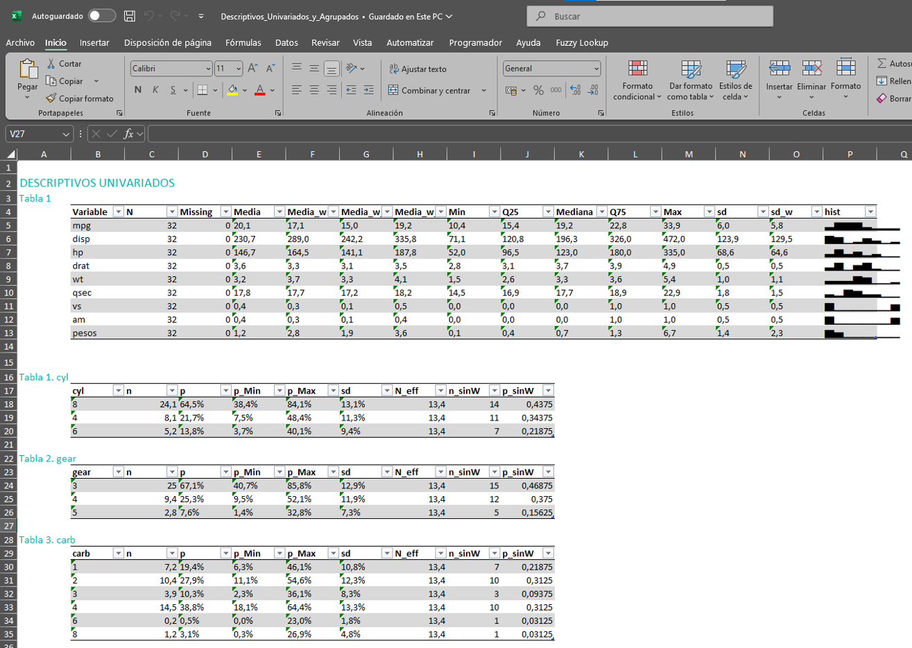

<!-- README.md is generated from README.Rmd. Please edit that file -->

```{r, include = FALSE}
knitr::opts_chunk$set(
  collapse = TRUE,
  comment = "#>",
  fig.path = "man/figures/README-",
  out.width = "100%"
)
```

# analisisDescriptivo

<!-- badges: start -->

<!-- badges: end -->

`analisisDescriptivo` es un paquete de R diseñado para facilitar la generación de estadísticas descriptivas para variables numéricas y categóricas. Proporciona funciones para análisis univariado, análisis agrupado (bivariado) y herramientas para formatear los resultados para su exportación, por ejemplo, a Excel. Además, calcula los intervalos de confianza de las medias y proporciones (con y sin variable de ponderación), calcula si las diferencias de medias son significativas entre grupos (a través de OLS) y si hay diferencia significativa entre dos variables categóricas (mediante chi cuadrado).

## Advertencia

Actualmente, una parte de este documento así como la mayor parte de documentación de las funciones está elaborado principalmente a través del modelo 03-mini de ChatGPT, por lo que puede haber algún error. Tampoco se explica, por ahora, con todo detalle las funcionalidades del paquete. Esta tarea está pendiente de llevarse a cabo.

## Dependencias

Para utilizar este paquete es necesario tener instalados los siguientes paquetes: `dplyr`, `emmeans`, `magrittr`, `openxlsx`, `purrr`, `rlang`, `scales`, `skimr`, `stringr`, `tibble`, `tidyr`. Para hacerlo se puede utilizar la función `install.packages`.

## Objetivo

El objetivo o razón de ser de este paquete es automatizar la tarea de explotación de datos habitual:

-   Descriptivos univariados

-   Descriptivos agrupados por una variabel categórica clave: Tratamiento vs Control; Territorio; u cualquier otra variable categórica. Además, identifica si existen diferencias significativas.

-   Descriptivos cuando la variable dependiente o de interés es una variable numérica: se extraen estadístics de relación con las otras variables numéricas y, si son categóricas, se utiliza la función anterior.

Estas son las relaciones bivariadas que pueden analizarse:

-   Variable Categórica frente a Variables Categóricas o Variables Numéricas

-   Variable Numérica frente a Variables Categóricas o Variables Numéricas

## Características

-   **Análisis descriptivo univariado para variables categóricas:** Calcula frecuencias, porcentajes y sus intervalos de confianza (usando el método de Wilson) para variables categóricas (con o sin ponderar).

<!-- -->

-   **Análisis descriptivo univariado para variables numéricas:** Obtén estadísticas básicas (media, mediana, cuartiles, desviación estándar, histograma ) de variables numéricas (con o sin ponderar)..

<!-- -->

-   **Análisis descriptivo agrupado:** Genera de forma sencilla descriptivos numéricos y categóricos agrupando por las categorías de una variable categórica.

<!-- -->

-   **Análisis descriptivo para una variable numérica (variable dependiente o de interés):** Genera de forma sencilla descriptivos de relación respecto a las variables numéricas explicativas y estadísticos agrupando por las categorías de una variable categórica.

<!-- -->

-   **Análisis descriptivo para una variable categórica (variable dependiente o de interés):** Genera de forma sencilla descriptivos de relación respecto a las variables numéricas explicativas y estadísticos agrupando por las categorías de una variable categórica. La principal diferencia respecto al análisis agrupado es que en el análisis con las variables categórica se calculan los porcentajes agrupando por la variable categórica, en vez de la variable de interés.

<!-- -->

-   **Exportación a Excel:** Exporta a Excel los resultados ya formateadas en una o varias hojas.

## Instalación

Puedes instalar la versión de desarrollo de `analisisDescriptivo` desde GitHub con:

```{r example, eval=FALSE}
# install.packages("remotes")
remotes::install_github("Adan-gz/analisisDescriptivo")

```

## Uso Rápido

Las funciones principales del paquete son:

1.  `generar_descriptivos_univariados`: generar los descriptivos univariados de variables categóricas y numéricas. Si no se indican cuáles se seleccionan de manera automática.
2.  `generar_descriptivos_agrupados`: calcula estadísticos descriptivos de variables categóricas y numéricas según las categorías de la variable categórica indicada.
3.  `generar_descriptivos_VDnumerica`: calcula estadísticos de relación entre 2 variables numéricas y estadísticis descriptivos de la variable numérica según las categorías de las variables categóricas.
4.  `generar_descriptivos_VDcategorica`: calcula estadísticos de relación entre 2 variables categóricas (agrupando por la variable independiente) y entre la categórica y la numérica.
5.  `crear_Excel`: genera un workbook a través de `openxlsx` y exporta el archivo Excel ya formateado.

**Ahora mismo las funciones no están diseñadas para poder pasar más de 1 variable de agrupación**. Podría funcionar, pero el comportamiento es imprevisto. Si se quiere agrupar por más de 1 variable la estrategia más sencilla es: crear una nueva variable uniendo los valores de cada fila de ambas y pasarle a la función esta nueva variable.

A continuación, se muestra un ejemplo básico que ilustra cómo generar estadísticas descriptivas utilizando el paquete:

```{r eval=TRUE, message=FALSE, warning=FALSE}

library(analisisDescriptivo)
library(dplyr)
# creamos un tibble temporal a partir de los datos mtcars que vienen por defecto en R
temp <- mtcars %>%
  mutate('cyl'   = as.character(cyl),
         'carb'  = factor(carb),
         'gear'  = factor(gear),
         # una variable para agrupar
         'grupo' = sample(c('Tratamiento','Control'),nrow(.),T),
         # añadimos un vector de pesos
         'pesos'     = rlnorm(32)
         )

# Análisis descriptivo univariado (tanto numérico como categórico)
resultados_univ <- generar_descriptivos_univariados( 
  datos     = temp,
  selecc_vars_auto = TRUE, # dejamos que seleccione las variables automáticamente
  var_peso  = "pesos", # vector para ponderar
  num_unificar_1tabla = TRUE # por defecto devuelve una lista, donde cada elemento son los descriptivos de cada variable. Con este argumento en TRUE devuelve un dataframe con todas las variables juntas, pero sólo para los descriptivos numéricos
)
```

El output obtenido se ve de esta forma en la consola de R:

```{r eval=TRUE, message=FALSE, warning=FALSE}
print(resultados_univ)
```

Y se puede exportar a Excel de esta forma. Así se ha generado en R el objeto workbook y además se ha exportado el Excel.

```{r eval=TRUE, message=FALSE, warning=FALSE}
workbook <- crear_Excel( 
  resultados_univ, 
  unificar_misma_hoja = TRUE, 
  titulos_principales = 'DESCRIPTIVOS UNIVARIADOS', 
  exportar            = TRUE, 
  nombre_archivo      = 'Descriptivos_Univariados'
)
```

Así se vería:



Si queremos obtener los descriptivos agrupados por la variable `grupo` bastaría con utilizar la función `generar_descriptivos_agrupados`.

En el caso de las variables numéricas, se realiza una regresión OLS y se incluyen los coeficientes (`Dif_categoriaReferencia`) y el `p.valor`. Si se ha especificado pesos las regresiones se calculan aplicando la ponderación. Pero la distribución y cuartiles se calculan sin ponderar.

```{r eval=TRUE, message=FALSE, warning=FALSE}
# Análisis descriptivo agrupado (tanto numérico como categórico)
resultados_agrupados <- generar_descriptivos_agrupados( 
  datos      = temp,
  # podriamos indicar las variables de intereres con 'vars_categoricas' y 'vars_numericas', pero dejamos que seleccione las variables automáticamente
  vars_grupo = 'grupo',
  var_peso   = "pesos", # vector para ponderar
  num_unificar_1tabla = FALSE # en este caso no queremos que unifique los descriptivos numéricos en 1 tabla
)
print(resultados_agrupados)
```

Y así podríamos añadirlo al workbook existente:

```{r eval=TRUE, message=FALSE, warning=FALSE}
crear_Excel(
  workbook            = workbook,
  list_list_tablas    = resultados_agrupados,
  unificar_misma_hoja = TRUE, # unificamos 
  nombres_hojas       = 'Hoja_Agrupada', # ponemos nombre a la hoja
  titulos_principales = 'DESCRIPTIVOS AGRUPADOS', 
  exportar            = TRUE,
  nombre_archivo      = 'Descriptivos_Univariados_y_Agrupados'
)
```

Y este sería el output (se muestra sólo la segunda hoja):


Únicamente es necesario crear el workbook (`workbook <- crear_Excel()`) la primera vez. Las siguientes al llamar la función `crear_Excel()` ya se actualiza el objeto creado de forma automática.

Por último, podrías estar interesados en estudiar como variable dependiente `mpg`. En este caso se calcula:

-   Variable independiente numérica: coeficiente de correlación, coeficiente de una regresión lineal y su p.valor (aplicando pesos si corresponde), y se trocea la X numérica en cuartiles y se calcula la media de la VD para indicar por algún posible patrón no lineal.

-   Variable independiente categórica: produce el mismo output que el visualizado en la imagen superior.

```{r eval=TRUE, message=FALSE, warning=FALSE}
resultados_VD_mpg <- generar_descriptivos_VDnumerica(
  temp,
  var_VDnum = 'mpg',
  var_peso  = 'pesos', 
  selecc_vars_auto = TRUE,
  num_unificar_1tabla = T
)
print(resultados_VD_mpg)
```

Estos resultados podrían añadirse al workbook e imprimirse sobreescribiendo el actual:

```{r eval=TRUE, message=FALSE, warning=FALSE}
crear_Excel(
  workbook            = workbook,
  list_list_tablas    = resultados_VD_mpg,
  unificar_misma_hoja = TRUE, # unificamos 
  nombres_hojas       = 'Hoja_MPG', # ponemos nombre a la hoja
  titulos_principales = 'DESCRIPTIVOS AGRUPADOS', 
  exportar            = TRUE,
  nombre_archivo      = 'Descriptivos_Univariados_y_Agrupados'
)
```

Así se visualizaría:


Finalmente, si se tuviera interés en analizar una variable dependiente categórica, el código sería muy similar. 

```{r eval=TRUE, message=FALSE, warning=FALSE}
resultados_VD_cyl <- generar_descriptivos_VDcategorica(
  temp,
  var_VDcat = 'cyl',
  var_peso  = 'pesos',
  estrategia_valoresPerdidos = 'A',
  selecc_vars_auto = TRUE,
)
print(resultados_VD_cyl)
```

El output se incluiría en el Excel de la misma forma que en los anteriores casos.

## Detalles

Para conocer mejor los parámetros de las funciones puede consultar la documentación de cada una, por ejemplo, `?generar_descriptivos_categoricos`).

## Contribución

¡Las contribuciones, informes de errores y solicitudes de nuevas funcionalidades son bienvenidos!\
Por favor, abre un issue o envía un pull request en [GitHub](https://github.com/Adan-gz/analisisDescriptivo).

## Licencia

Este paquete está disponible bajo la Licencia MIT.
