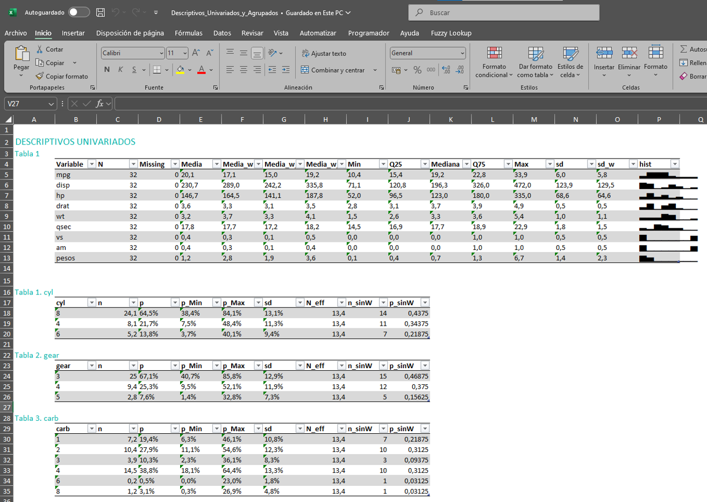
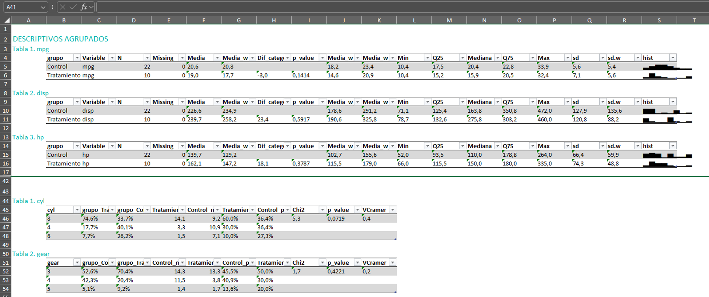
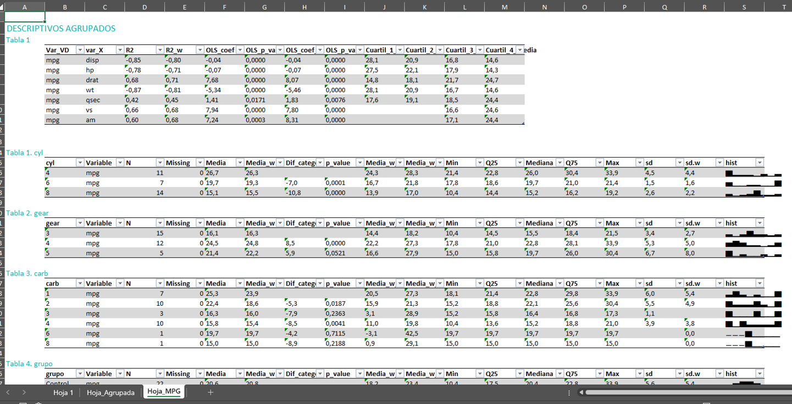

<!-- README.md is generated from README.Rmd. Please edit that file -->

# analisisDescriptivo

<!-- badges: start -->
<!-- badges: end -->

`analisisDescriptivo` es un paquete de R diseñado para facilitar la
generación de estadísticas descriptivas para variables numéricas y
categóricas. Proporciona funciones para análisis univariado, análisis
agrupado (bivariado) y herramientas para formatear los resultados para
su exportación, por ejemplo, a Excel. Además, calcula los intervalos de
confianza de las medias y proporciones (con y sin variable de
ponderación), calcula si las diferencias de medias son significativas
entre grupos (a través de OLS) y si hay diferencia significativa entre
dos variables categóricas (mediante chi cuadrado).

## Advertencia

Actualmente, una parte de este documento así como la mayor parte de
documentación de las funciones está elaborado principalmente a través
del modelo 03-mini de ChatGPT, por lo que puede haber algún error.
Tampoco se explica, por ahora, con todo detalle las funcionalidades del
paquete. Esta tarea está pendiente de llevarse a cabo.

## Dependencias

Para utilizar este paquete es necesario tener instalados los siguientes
paquetes: `dplyr`, `emmeans`, `magrittr`, `openxlsx`, `purrr`, `rlang`,
`scales`, `skimr`, `stringr`, `tibble`, `tidyr`. Para hacerlo se puede
utilizar la función `install.packages`.

## Objetivo

El objetivo o razón de ser de este paquete es automatizar la tarea de
explotación de datos habitual:

- Descriptivos univariados

- Descriptivos agrupados por una variabel categórica clave: Tratamiento
  vs Control; Territorio; u cualquier otra variable categórica. Además,
  identifica si existen diferencias significativas.

- Descriptivos cuando la variable dependiente o de interés es una
  variable numérica: se extraen estadístics de relación con las otras
  variables numéricas y, si son categóricas, se utiliza la función
  anterior.

Estas son las relaciones bivariadas que pueden analizarse:

- Variable Categórica frente a Variables Categóricas o Variables
  Numéricas

- Variable Numérica frente a Variables Categóricas o Variables Numéricas

## Características

- **Análisis descriptivo univariado para variables categóricas:**
  Calcula frecuencias, porcentajes y sus intervalos de confianza (usando
  el método de Wilson) para variables categóricas (con o sin ponderar).

<!-- -->

- **Análisis descriptivo univariado para variables numéricas:** Obtén
  estadísticas básicas (media, mediana, cuartiles, desviación estándar,
  histograma ) de variables numéricas (con o sin ponderar)..

<!-- -->

- **Análisis descriptivo agrupado:** Genera de forma sencilla
  descriptivos numéricos y categóricos agrupando por las categorías de
  una variable categórica.

<!-- -->

- **Análisis descriptivo para una variable numérica (variable
  dependiente o de interés):** Genera de forma sencilla descriptivos de
  relación respecto a las variables numéricas explicativas y
  estadísticos agrupando por las categorías de una variable categórica.

<!-- -->

- **Exportación a Excel:** Exporta a Excel los resultados ya formateadas
  en una o varias hojas.

## Instalación

Puedes instalar la versión de desarrollo de `analisisDescriptivo` desde
GitHub con:

``` r
# install.packages("remotes")
remotes::install_github("Adan-gz/analisisDescriptivo")
```

## Uso Rápido

Las funciones principales del paquete son 3:

1.  `generar_descriptivos_univariados`: generar los descriptivos
    univariados de variables categóricas y numéricas. Si no se indican
    cuáles se seleccionan de manera automática.
2.  `generar_descriptivos_agrupados`: calcula estadísticis descriptivos
    de variables categóricas y numéricas según las categorías de la
    variable categórica indicada.
3.  `generar_descriptivos_VDnumerica`: calcula estadísticos de relación
    entre 2 variables numéricas y estadísticis descriptivos de la
    variable numérica según las categorías de las variables categóricas.
4.  `crear_Excel`: genera un workbook a través de `openxlsx` y exporta
    el archivo Excel ya formateado.

**Ahora mismo las funciones no están diseñadas para poder pasar más de 1
variable de agrupación**. Podría funcionar, pero el comportamiento es
imprevisto. Si se quiere agrupar por más de 1 variable la estrategia más
sencilla es: crear una nueva variable uniendo los valores de cada fila
de ambas y pasarle a la función esta nueva variable.

A continuación, se muestra un ejemplo básico que ilustra cómo generar
estadísticas descriptivas utilizando el paquete:

``` r

library(analisisDescriptivo)
library(dplyr)
# creamos un tibble temporal a partir de los datos mtcars que vienen por defecto en R
temp <- mtcars %>%
  mutate('cyl'   = as.character(cyl),
         'carb'  = factor(carb),
         'gear'  = factor(gear),
         # una variable para agrupar
         'grupo' = sample(c('Tratamiento','Control'),nrow(.),T),
         # añadimos un vector de pesos
         'pesos'     = rlnorm(32)
         )

# Análisis descriptivo univariado (tanto numérico como categórico)
resultados_univ <- generar_descriptivos_univariados( 
  datos     = temp,
  selecc_vars_auto = TRUE, # dejamos que seleccione las variables automáticamente
  var_peso  = "pesos", # vector para ponderar
  num_unificar_1tabla = TRUE # por defecto devuelve una lista, donde cada elemento son los descriptivos de cada variable. Con este argumento en TRUE devuelve un dataframe con todas las variables juntas, pero sólo para los descriptivos numéricos
)
```

El output obtenido se ve de esta forma en la consola de R:

``` r
print(resultados_univ)
#> $Numericas
#> # A tibble: 9 × 15
#>   Variable     N Missing   Media Media_w Media_w_Min_95 Media_w_Max_95    Min
#>   <chr>    <int>   <int>   <dbl>   <dbl>          <dbl>          <dbl>  <dbl>
#> 1 mpg         32       0  20.1    19.6           17.5           21.7   10.4  
#> 2 disp        32       0 231.    229.           185.           274.    71.1  
#> 3 hp          32       0 147.    156.           128.           184.    52    
#> 4 drat        32       0   3.60    3.64           3.45           3.84   2.76 
#> 5 wt          32       0   3.22    3.15           2.80           3.50   1.51 
#> 6 qsec        32       0  17.8    17.7           17.0           18.4   14.5  
#> 7 vs          32       0   0.438   0.445          0.263          0.627  0    
#> 8 am          32       0   0.406   0.361          0.185          0.537  0    
#> 9 pesos       32       0   1.39    2.76           1.95           3.56   0.209
#> # ℹ 7 more variables: Q25 <dbl>, Mediana <dbl>, Q75 <dbl>, Max <dbl>, sd <dbl>,
#> #   sd_w <dbl>, hist <chr>
#> 
#> $Categoricas
#> $Categoricas$cyl
#>   cyl    n         p      p_Min     p_Max         sd N_eff n_sinW  p_sinW
#> 1   8 20.5 0.4603358 0.24947381 0.6864208 0.12392359  16.2     14 0.43750
#> 2   4 16.8 0.3763959 0.18656107 0.6136696 0.12045691  16.2     11 0.34375
#> 3   6  7.3 0.1632683 0.05355611 0.4022171 0.09189648  16.2      7 0.21875
#> 
#> $Categoricas$gear
#>   gear    n         p      p_Min     p_Max         sd N_eff n_sinW  p_sinW
#> 1    3 26.4 0.5925009 0.35876913 0.7907310 0.12216946  16.2     15 0.46875
#> 2    4 10.7 0.2408602 0.09678233 0.4843951 0.10631589  16.2     12 0.37500
#> 3    5  7.4 0.1666390 0.05527827 0.4059427 0.09265305  16.2      5 0.15625
#> 
#> $Categoricas$carb
#>   carb    n          p       p_Min     p_Max         sd N_eff n_sinW  p_sinW
#> 1    1 13.6 0.30447676 0.136945490 0.5470493 0.11441625  16.2      7 0.21875
#> 2    2 10.6 0.23699315 0.094466891 0.4804607 0.10572725  16.2     10 0.31250
#> 3    3  2.9 0.06505409 0.011997961 0.2850412 0.06131763  16.2      3 0.09375
#> 4    4 12.9 0.28953377 0.127177031 0.5326668 0.11276547  16.2     10 0.31250
#> 5    6  2.1 0.04685441 0.006801755 0.2608230 0.05254237  16.2      1 0.03125
#> 6    8  2.5 0.05708781 0.009591708 0.2745723 0.05768490  16.2      1 0.03125
#> 
#> $Categoricas$grupo
#>         grupo    n         p     p_Min     p_Max        sd N_eff n_sinW  p_sinW
#> 1     Control 23.1 0.5179858 0.2956177 0.7334509 0.1242349  16.2     15 0.46875
#> 2 Tratamiento 21.5 0.4820142 0.2665491 0.7043823 0.1242349  16.2     17 0.53125
#> 
#> 
#> attr(,"peso")
#> [1] TRUE
```

Y se puede exportar a Excel de esta forma. Así se ha generado en R el
objeto workbook y además se ha exportado el Excel.

``` r
workbook <- crear_Excel( 
  resultados_univ, 
  unificar_misma_hoja = TRUE, 
  titulos_principales = 'DESCRIPTIVOS UNIVARIADOS', 
  exportar            = TRUE, 
  nombre_archivo      = 'Descriptivos_Univariados'
)
```

Así se vería:



Si queremos obtener los descriptivos agrupados por la variable `grupo`
bastaría con utilizar la función `generar_descriptivos_agrupados`.

En el caso de las variables numéricas, se realiza una regresión OLS y se
incluyen los coeficientes (`Dif_categoriaReferencia`) y el `p.valor`. Si
se ha especificado pesos las regresiones se calculan aplicando la
ponderación. Pero la distribución y cuartiles se calculan sin ponderar.

``` r
# Análisis descriptivo agrupado (tanto numérico como categórico)
resultados_agrupados <- generar_descriptivos_agrupados( 
  datos      = temp,
  # podriamos indicar las variables de intereres con 'vars_categoricas' y 'vars_numericas', pero dejamos que seleccione las variables automáticamente
  vars_grupo = 'grupo',
  var_peso   = "pesos", # vector para ponderar
  num_unificar_1tabla = FALSE # en este caso no queremos que unifique los descriptivos numéricos en 1 tabla
)
print(resultados_agrupados)
#> $Numericas
#> $Numericas$mpg
#> # A tibble: 2 × 18
#>   grupo      Variable     N Missing Media Media_w Dif_categoriaReferen…¹ p_value
#>   <chr>      <chr>    <int>   <int> <dbl>   <dbl>                  <dbl>   <dbl>
#> 1 Control    mpg         15       0  21.9    20.9                  NA     NA    
#> 2 Tratamien… mpg         17       0  18.5    18.3                  -2.58   0.211
#> # ℹ abbreviated name: ¹​Dif_categoriaReferencia
#> # ℹ 10 more variables: Media_w_Min_95 <dbl>, Media_w_Max_95 <dbl>, Min <dbl>,
#> #   Q25 <dbl>, Mediana <dbl>, Q75 <dbl>, Max <dbl>, sd <dbl>, sd.w <dbl>,
#> #   hist <chr>
#> 
#> $Numericas$disp
#> # A tibble: 2 × 18
#>   grupo      Variable     N Missing Media Media_w Dif_categoriaReferen…¹ p_value
#>   <chr>      <chr>    <int>   <int> <dbl>   <dbl>                  <dbl>   <dbl>
#> 1 Control    disp        15       0  201.    194.                   NA   NA     
#> 2 Tratamien… disp        17       0  257.    267.                   73.0  0.0949
#> # ℹ abbreviated name: ¹​Dif_categoriaReferencia
#> # ℹ 10 more variables: Media_w_Min_95 <dbl>, Media_w_Max_95 <dbl>, Min <dbl>,
#> #   Q25 <dbl>, Mediana <dbl>, Q75 <dbl>, Max <dbl>, sd <dbl>, sd.w <dbl>,
#> #   hist <chr>
#> 
#> $Numericas$hp
#> # A tibble: 2 × 18
#>   grupo      Variable     N Missing Media Media_w Dif_categoriaReferen…¹ p_value
#>   <chr>      <chr>    <int>   <int> <dbl>   <dbl>                  <dbl>   <dbl>
#> 1 Control    hp          15       0  146.    154.                  NA     NA    
#> 2 Tratamien… hp          17       0  147.    158.                   3.76   0.895
#> # ℹ abbreviated name: ¹​Dif_categoriaReferencia
#> # ℹ 10 more variables: Media_w_Min_95 <dbl>, Media_w_Max_95 <dbl>, Min <dbl>,
#> #   Q25 <dbl>, Mediana <dbl>, Q75 <dbl>, Max <dbl>, sd <dbl>, sd.w <dbl>,
#> #   hist <chr>
#> 
#> $Numericas$drat
#> # A tibble: 2 × 18
#>   grupo      Variable     N Missing Media Media_w Dif_categoriaReferen…¹ p_value
#>   <chr>      <chr>    <int>   <int> <dbl>   <dbl>                  <dbl>   <dbl>
#> 1 Control    drat        15       0  3.76    3.73                 NA      NA    
#> 2 Tratamien… drat        17       0  3.45    3.55                 -0.175   0.373
#> # ℹ abbreviated name: ¹​Dif_categoriaReferencia
#> # ℹ 10 more variables: Media_w_Min_95 <dbl>, Media_w_Max_95 <dbl>, Min <dbl>,
#> #   Q25 <dbl>, Mediana <dbl>, Q75 <dbl>, Max <dbl>, sd <dbl>, sd.w <dbl>,
#> #   hist <chr>
#> 
#> $Numericas$wt
#> # A tibble: 2 × 18
#>   grupo      Variable     N Missing Media Media_w Dif_categoriaReferen…¹ p_value
#>   <chr>      <chr>    <int>   <int> <dbl>   <dbl>                  <dbl>   <dbl>
#> 1 Control    wt          15       0  3.04    2.97                 NA      NA    
#> 2 Tratamien… wt          17       0  3.37    3.33                  0.359   0.301
#> # ℹ abbreviated name: ¹​Dif_categoriaReferencia
#> # ℹ 10 more variables: Media_w_Min_95 <dbl>, Media_w_Max_95 <dbl>, Min <dbl>,
#> #   Q25 <dbl>, Mediana <dbl>, Q75 <dbl>, Max <dbl>, sd <dbl>, sd.w <dbl>,
#> #   hist <chr>
#> 
#> $Numericas$qsec
#> # A tibble: 2 × 18
#>   grupo      Variable     N Missing Media Media_w Dif_categoriaReferen…¹ p_value
#>   <chr>      <chr>    <int>   <int> <dbl>   <dbl>                  <dbl>   <dbl>
#> 1 Control    qsec        15       0  17.6    17.8                 NA      NA    
#> 2 Tratamien… qsec        17       0  18.0    17.6                 -0.244   0.726
#> # ℹ abbreviated name: ¹​Dif_categoriaReferencia
#> # ℹ 10 more variables: Media_w_Min_95 <dbl>, Media_w_Max_95 <dbl>, Min <dbl>,
#> #   Q25 <dbl>, Mediana <dbl>, Q75 <dbl>, Max <dbl>, sd <dbl>, sd.w <dbl>,
#> #   hist <chr>
#> 
#> $Numericas$vs
#> # A tibble: 2 × 18
#>   grupo      Variable     N Missing Media Media_w Dif_categoriaReferen…¹ p_value
#>   <chr>      <chr>    <int>   <int> <dbl>   <dbl>                  <dbl>   <dbl>
#> 1 Control    vs          15       0 0.467   0.511                 NA      NA    
#> 2 Tratamien… vs          17       0 0.412   0.374                 -0.137   0.452
#> # ℹ abbreviated name: ¹​Dif_categoriaReferencia
#> # ℹ 10 more variables: Media_w_Min_95 <dbl>, Media_w_Max_95 <dbl>, Min <dbl>,
#> #   Q25 <dbl>, Mediana <dbl>, Q75 <dbl>, Max <dbl>, sd <dbl>, sd.w <dbl>,
#> #   hist <chr>
#> 
#> $Numericas$am
#> # A tibble: 2 × 18
#>   grupo      Variable     N Missing Media Media_w Dif_categoriaReferen…¹ p_value
#>   <chr>      <chr>    <int>   <int> <dbl>   <dbl>                  <dbl>   <dbl>
#> 1 Control    am          15       0 0.6     0.501                 NA     NA     
#> 2 Tratamien… am          17       0 0.235   0.212                 -0.289  0.0950
#> # ℹ abbreviated name: ¹​Dif_categoriaReferencia
#> # ℹ 10 more variables: Media_w_Min_95 <dbl>, Media_w_Max_95 <dbl>, Min <dbl>,
#> #   Q25 <dbl>, Mediana <dbl>, Q75 <dbl>, Max <dbl>, sd <dbl>, sd.w <dbl>,
#> #   hist <chr>
#> 
#> 
#> $Categoricas
#> $Categoricas$cyl
#> # A tibble: 3 × 10
#>   cyl   grupo_Tratamiento_p grupo_Control_p Tratamiento_n Control_n
#>   <chr>               <dbl>           <dbl>         <dbl>     <dbl>
#> 1 8                   0.616           0.315          13.2       7.3
#> 2 4                   0.222           0.520           4.8      12  
#> 3 6                   0.162           0.164           3.5       3.8
#> # ℹ 5 more variables: Tratamiento_p_sinW <dbl>, Control_p_sinW <dbl>,
#> #   Chi2 <dbl>, p_value <dbl>, VCramer <dbl>
#> 
#> $Categoricas$gear
#> # A tibble: 3 × 10
#>   gear  grupo_Control_p grupo_Tratamiento_p Control_n Tratamiento_n
#>   <fct>           <dbl>               <dbl>     <dbl>         <dbl>
#> 1 3               0.456               0.739      10.5          15.9
#> 2 4               0.222               0.261       5.1           5.6
#> 3 5               0.322              NA           7.4          NA  
#> # ℹ 5 more variables: Control_p_sinW <dbl>, Tratamiento_p_sinW <dbl>,
#> #   Chi2 <dbl>, p_value <dbl>, VCramer <dbl>
#> 
#> $Categoricas$carb
#> # A tibble: 6 × 10
#>   carb  grupo_Control_p grupo_Tratamiento_p Control_n Tratamiento_n
#>   <fct>           <dbl>               <dbl>     <dbl>         <dbl>
#> 1 1              0.441               0.158       10.2           3.4
#> 2 2              0.0795              0.406        1.8           8.7
#> 3 3              0.0376              0.0945       0.9           2  
#> 4 4              0.241               0.341        5.6           7.3
#> 5 6              0.0905             NA            2.1          NA  
#> 6 8              0.110              NA            2.5          NA  
#> # ℹ 5 more variables: Control_p_sinW <dbl>, Tratamiento_p_sinW <dbl>,
#> #   Chi2 <dbl>, p_value <dbl>, VCramer <dbl>
#> 
#> 
#> attr(,"vars_grupo")
#> [1] TRUE
#> attr(,"peso")
#> [1] TRUE
```

Y así podríamos añadirlo al workbook existente:

``` r
crear_Excel(
  workbook            = workbook,
  list_list_tablas    = resultados_agrupados,
  unificar_misma_hoja = TRUE, # unificamos 
  nombres_hojas       = 'Hoja_Agrupada', # ponemos nombre a la hoja
  titulos_principales = 'DESCRIPTIVOS AGRUPADOS', 
  exportar            = TRUE,
  nombre_archivo      = 'Descriptivos_Univariados_y_Agrupados'
)
#> A Workbook object.
#>  
#> Worksheets:
#>  Sheet 1: "Hoja 1"
#>  
#> 
#>  Sheet 2: "Hoja_Agrupada"
#>  
#> 
#>  
#>  Worksheet write order: 1, 2
#>  Active Sheet 1: "Hoja 1" 
#>  Position: 1
```

Y este sería el output (se muestra sólo la segunda hoja):



Únicamente es necesario crear el workbook (`workbook <- crear_Excel()`)
la primera vez. Las siguientes al llamar la función `crear_Excel()` ya
se actualiza el objeto creado de forma automática.

Por último, podrías estar interesados en estudiar como variable
dependiente `mpg`. En este caso se calcula:

- Variable independiente numérica: coeficiente de correlación,
  coeficiente de una regresión lineal y su p.valor (aplicando pesos si
  corresponde), y se trocea la X numérica en cuartiles y se calcula la
  media de la VD para indicar por algún posible patrón no lineal.

- Variable independiente categórica: produce el mismo output que el
  visualizado en la imagen superior.

``` r
resultados_VD_mpg <- generar_descriptivos_VDnumerica(
  temp,
  var_VDnum = 'mpg',
  var_peso  = 'pesos', 
  selecc_vars_auto = TRUE,
  num_unificar_1tabla = T
)
print(resultados_VD_mpg)
#> $Numericas
#> # A tibble: 7 × 12
#>   Var_VD var_X     R2   R2_w OLS_coef OLS_p_value OLS_coef_w OLS_p_value_w
#>   <chr>  <chr>  <dbl>  <dbl>    <dbl>       <dbl>      <dbl>         <dbl>
#> 1 mpg    disp  -0.848 -0.826  -0.0412    9.38e-10    -0.0395      1.23e- 9
#> 2 mpg    hp    -0.776 -0.774  -0.0682    1.79e- 7    -0.0581      6.73e- 8
#> 3 mpg    drat   0.681  0.667   7.68      1.78e- 5     7.24        1.68e- 5
#> 4 mpg    wt    -0.868 -0.841  -5.34      1.29e-10    -5.13        2.69e-10
#> 5 mpg    qsec   0.419  0.500   1.41      1.71e- 2     1.54        2.78e- 3
#> 6 mpg    vs     0.664  0.689   7.94      3.42e- 5     8.06        6.73e- 6
#> 7 mpg    am     0.600  0.542   7.24      2.85e- 4     6.56        9.95e- 4
#> # ℹ 4 more variables: Cuartil_1_Media <dbl>, Cuartil_2_Media <dbl>,
#> #   Cuartil_3_Media <dbl>, Cuartil_4_Media <dbl>
#> 
#> $Categoricas
#> $Categoricas$cyl
#> # A tibble: 3 × 18
#>   cyl   Variable     N Missing Media Media_w Dif_categoriaReferencia  p_value
#>   <chr> <chr>    <int>   <int> <dbl>   <dbl>                   <dbl>    <dbl>
#> 1 4     mpg         11       0  26.7    25.5                   NA    NA      
#> 2 6     mpg          7       0  19.7    19.4                   -6.10  1.02e-3
#> 3 8     mpg         14       0  15.1    14.9                  -10.5   2.22e-9
#> # ℹ 10 more variables: Media_w_Min_95 <dbl>, Media_w_Max_95 <dbl>, Min <dbl>,
#> #   Q25 <dbl>, Mediana <dbl>, Q75 <dbl>, Max <dbl>, sd <dbl>, sd.w <dbl>,
#> #   hist <chr>
#> 
#> $Categoricas$gear
#> # A tibble: 3 × 18
#>   gear  Variable     N Missing Media Media_w Dif_categoriaReferencia    p_value
#>   <chr> <chr>    <int>   <int> <dbl>   <dbl>                   <dbl>      <dbl>
#> 1 3     mpg         15       0  16.1    17.0                   NA    NA        
#> 2 4     mpg         12       0  24.5    26.4                    9.37  0.0000231
#> 3 5     mpg          5       0  21.4    19.1                    2.09  0.336    
#> # ℹ 10 more variables: Media_w_Min_95 <dbl>, Media_w_Max_95 <dbl>, Min <dbl>,
#> #   Q25 <dbl>, Mediana <dbl>, Q75 <dbl>, Max <dbl>, sd <dbl>, sd.w <dbl>,
#> #   hist <chr>
#> 
#> $Categoricas$carb
#> # A tibble: 6 × 18
#>   carb  Variable     N Missing Media Media_w Dif_categoriaReferencia   p_value
#>   <chr> <chr>    <int>   <int> <dbl>   <dbl>                   <dbl>     <dbl>
#> 1 1     mpg          7       0  25.3    23.1                 NA      NA       
#> 2 2     mpg         10       0  22.4    23.1                  0.0205  0.993   
#> 3 3     mpg          3       0  16.3    16.0                 -7.02    0.0566  
#> 4 4     mpg         10       0  15.8    14.9                 -8.20    0.000640
#> 5 6     mpg          1       0  19.7    19.7                 -3.36    0.414   
#> 6 8     mpg          1       0  15      15                   -8.06    0.0393  
#> # ℹ 10 more variables: Media_w_Min_95 <dbl>, Media_w_Max_95 <dbl>, Min <dbl>,
#> #   Q25 <dbl>, Mediana <dbl>, Q75 <dbl>, Max <dbl>, sd <dbl>, sd.w <dbl>,
#> #   hist <chr>
#> 
#> $Categoricas$grupo
#> # A tibble: 2 × 18
#>   grupo      Variable     N Missing Media Media_w Dif_categoriaReferen…¹ p_value
#>   <chr>      <chr>    <int>   <int> <dbl>   <dbl>                  <dbl>   <dbl>
#> 1 Control    mpg         15       0  21.9    20.9                  NA     NA    
#> 2 Tratamien… mpg         17       0  18.5    18.3                  -2.58   0.211
#> # ℹ abbreviated name: ¹​Dif_categoriaReferencia
#> # ℹ 10 more variables: Media_w_Min_95 <dbl>, Media_w_Max_95 <dbl>, Min <dbl>,
#> #   Q25 <dbl>, Mediana <dbl>, Q75 <dbl>, Max <dbl>, sd <dbl>, sd.w <dbl>,
#> #   hist <chr>
```

Estos resultados podrían añadirse al workbook e imprimirse
sobreescribiendo el actual:

``` r
crear_Excel(
  workbook            = workbook,
  list_list_tablas    = resultados_VD_mpg,
  unificar_misma_hoja = TRUE, # unificamos 
  nombres_hojas       = 'Hoja_MPG', # ponemos nombre a la hoja
  titulos_principales = 'DESCRIPTIVOS AGRUPADOS', 
  exportar            = TRUE,
  nombre_archivo      = 'Descriptivos_Univariados_y_Agrupados'
)
#> A Workbook object.
#>  
#> Worksheets:
#>  Sheet 1: "Hoja 1"
#>  
#> 
#>  Sheet 2: "Hoja_Agrupada"
#>  
#> 
#>  Sheet 3: "Hoja_MPG"
#>  
#> 
#>  
#>  Worksheet write order: 1, 2, 3
#>  Active Sheet 1: "Hoja 1" 
#>  Position: 1
```

Así se visualizaría:



## Detalles

Para conocer mejor los parámetros de las funciones puede consultar la
documentación de cada una, por ejemplo,
`?generar_descriptivos_categoricos`).

## Contribución

¡Las contribuciones, informes de errores y solicitudes de nuevas
funcionalidades son bienvenidos!  
Por favor, abre un issue o envía un pull request en
[GitHub](https://github.com/Adan-gz/analisisDescriptivo).

## Licencia

Este paquete está disponible bajo la Licencia MIT.
